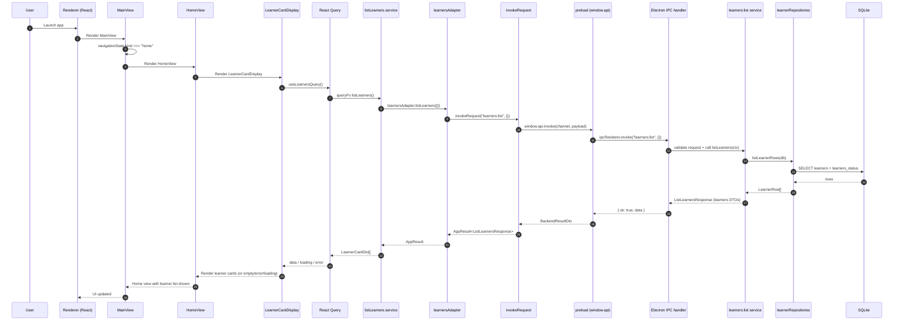

# Learner Card Display Sequence

```mermaid
sequenceDiagram
    autonumber
    participant U as User
    participant R as Renderer (React)
    participant MV as MainView
    participant HV as HomeView
    participant LCD as LearnerCardDisplay
    participant RQ as React Query
    participant SVC as listLearners.service
    participant ADP as learnersAdapter
    participant INV as invokeRequest
    participant PRE as preload (window.api)
    participant IPC as Electron IPC handler
    participant LS as learners:list service
    participant REPO as learnerRepositories
    participant DB as SQLite

    U->>R: Launch app
    R->>MV: Render MainView
    MV->>MV: navigationState.kind === "home"
    MV->>HV: Render HomeView
    HV->>LCD: Render LearnerCardDisplay
    LCD->>RQ: useLearnersQuery()
    RQ->>SVC: queryFn listLearners()
    SVC->>ADP: learnersAdapter.listLearners({})
    ADP->>INV: invokeRequest("learners:list", {})
    INV->>PRE: window.api.invoke(channel, payload)
    PRE->>IPC: ipcRenderer.invoke("learners:list", {})
    IPC->>LS: validate request + call listLearners(ctx)
    LS->>REPO: listLearnerRows(db)
    REPO->>DB: SELECT learners + learners_status
    DB-->>REPO: rows
    REPO-->>LS: LearnerRow[]
    LS-->>IPC: ListLearnersResponse (learners DTOs)
    IPC-->>PRE: { ok: true, data }
    PRE-->>INV: BackendResultDto
    INV-->>ADP: AppResult<ListLearnersResponse>
    ADP-->>SVC: AppResult
    SVC-->>RQ: LearnerCardDto[]
    RQ-->>LCD: data / loading / error
    LCD-->>HV: Render learner cards (or empty/error/loading)
    HV-->>MV: Home view with learner list shown
    MV-->>R: UI updated
```
